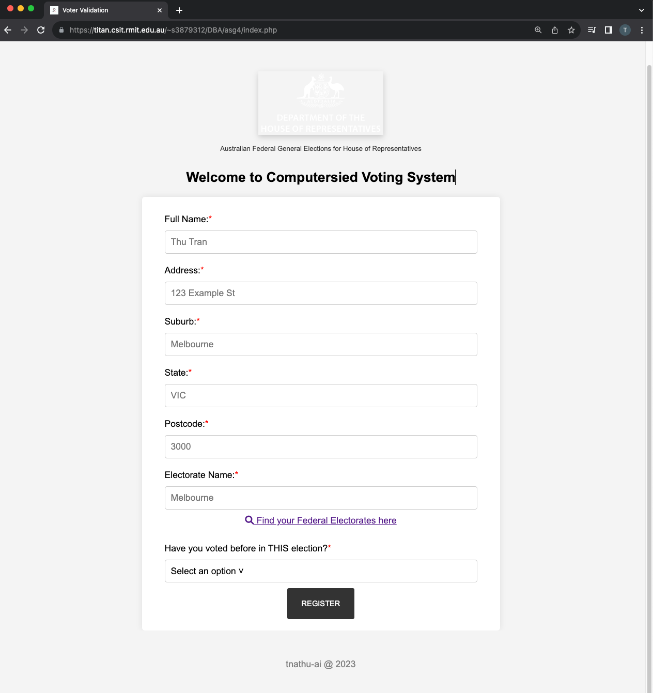
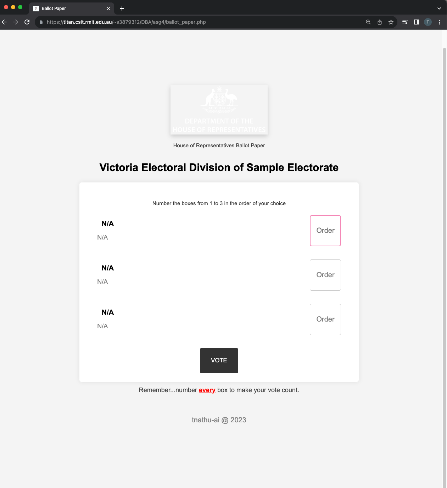
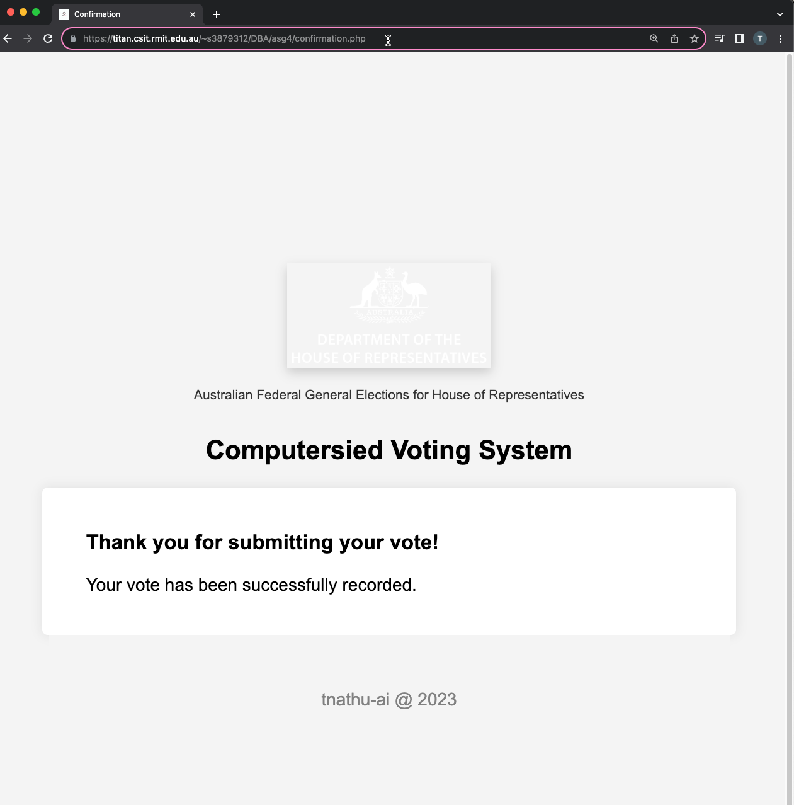
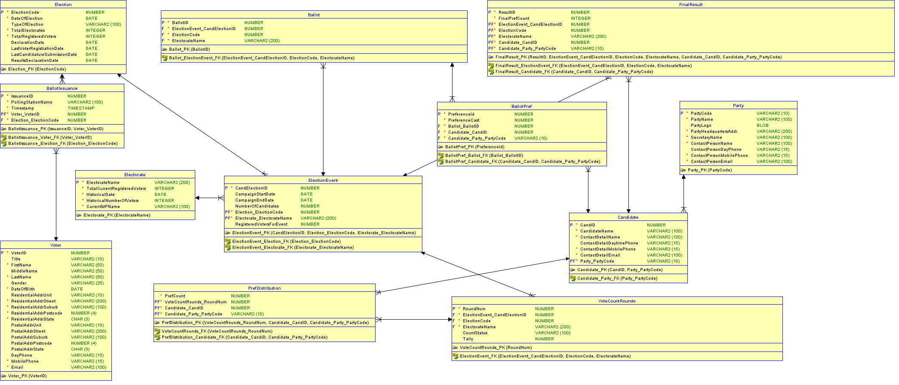
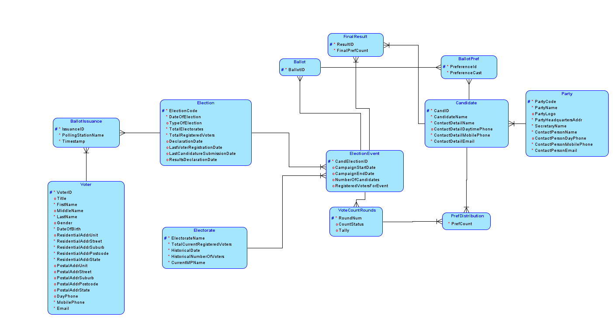

# DBA Assignment 4 Repository

🔗 Website link: https://titan.csit.rmit.edu.au/~s3879312/DBA/asg4/index.php

🔗 GitHub link: https://github.com/tnathu-ai/voting-system-oracle

Welcome to Australian Electoral Commission (AEC) Computerized Voting System repository! This project is designed for handling the voting process. Dive into the folder structure and file descriptions to get acquainted with the project.

## 💻 Basic Screen shots

|<a href="https://titan.csit.rmit.edu.au/~s3879312/DBA/asg4/index.php"></a>|<a href="https://titan.csit.rmit.edu.au/~s3879312/DBA/asg4/ballot_paper.php"></a>|<a href="https://titan.csit.rmit.edu.au/~s3879312/DBA/asg4/confirmation.php"></a>|
|:--:|:--:|:--:|
|Home Page|Ballot Paper Page|Confirmation Page|


<details>
<summary><b>📩 Detailed Introduction</b></summary>
<p>

The AEC is dedicated to offering Australians an independent electoral service. While ensuring integrity, accuracy, and transparency, the current manual voting system has its challenges. This project aims to transition to a computerised voting system for federal elections, addressing concerns like time efficiency, resource allocation, and environmental impact.

## Project Scope
This project's initial phase focuses on federal general elections for the House of Representatives. The following are out of scope:
Senate federal general elections:
+ Federal by-elections
+ State and territory elections
+ City and Shire Council elections
+ Referendums
+ Other AEC services

## Important Notes
Ballot vs Issuance Record: The Ballot is the digital equivalent of the ballot paper. It captures voters' preferences but cannot be associated with any voter. The Issuance Record, on the other hand, records when and where a ballot is issued to a specific voter. It tracks who has voted but should not be used to track down the ballot issued and cast by a specific voter.
Informal Ballots: The database should accommodate both formal and informal ballots. Informal ballots should be identified and eliminated from the counting process. A formal ballot must have a preference cast for each candidate. If there are n candidates, they must be numbered from 1 to n.
</p>
</details>


<details>
<summary><b>📋 Oracle SQL Database Setup Instructions</b></summary>
<p>

We've taken the liberty to pre-populate the database for you! :tada: If you face any issues like no data or data loss in the Oracle database, don't panic. Just follow these steps:

1. Run the script `DDL_script.ddl`
2. Run the script `insert_as4.sql`

### **Pre-Requisites**
Before diving in, ensure you have:
- Oracle SQL Server up and running :rocket:
- User role with permissions to create and modify tables :shield:

### **Let's Understand the Data Structure**

#### **Party Table**
- Contains info on political parties.
- Parties included:
  * Liberal Democrats (LDP)
  * Australian Labor Party (ALP)
  * ... and many more!

#### **Electorate Table**
- Houses electorate details.
- For example, `Hotham` electorate has:
  * Historical date: January 1, 2023
  * 50,000 historical voters
  * Placeholder for the current MP

#### **Election Table**
- Info on each election.
- Two federal elections predefined for `Hotham` and `Melbourne` on May 21, 2022.

#### **Voter Table**
- Voter registration details.
- Voters like `Joe Bloggs` and `Penny Chan` are predefined!

#### **Candidate Table**
- Data of election candidates.
- Examples:
  * Edward SOK from LDP in Hotham
  * Clare O'NEIL from ALP in Hotham

#### **Election Event Table**
- Contains election-specific events.
- Events predefined for both `Hotham` and `Melbourne`.

#### **Ballot Issuance Table**
- Note: No predefined data here as per requirements.

### **Implementation**

Use the SQL statements in `insert_as4.sql` to insert the above data. Remember to execute in the order mentioned above to ensure data integrity. Once done, you're all set to query or manipulate the data as you see fit!
</p>
</details>

<details>
<summary><b>🌿 Repository Structure</b></summary>
<p>

```
.
└── DBA
    └── asg4
        ├── 404.html                # Custom 404 error page for any unmatched routes or missing pages
        ├── Oracle_SQL              # Folder containing SQL scripts related to Oracle DB
        │   ├── DDL_script.ddl      # Script containing Data Definition Language commands for database setup
        │   └── insert_as4.sql      # Script for inserting sample data into the database
        ├── README.md               # Documentation about the project, how to set up, and other relevant details
        ├── ballot_paper.php        # Contains the actual ballot paper for voting
        ├── confirmation.php        # Page displayed after a user has successfully voted
        ├── css                     # Folder containing stylesheets
        │   └── styles.css          # Stylesheet for the entire website to ensure consistent design
        ├── db_connection.php       # PHP script to establish a connection to the Oracle database
        ├── footer.php              # Contains the common footer elements that can be included across pages
        ├── header.php              # Contains the common header elements and navigation that can be included across pages
        ├── htaccess                # Configuration file for use on web servers running Apache
        ├── images                  # Folder containing images used across the website
        │   ├── Logical.png         # Image representation of the logical database schema
        │   ├── Relational.png      # Image representation of the relational database schema
        │   ├── ballot_paper.png    # Image representation of the ballot paper
        │   ├── confirmation.png    # Image displayed on the confirmation page
        │   ├── dhr-logo.png        # Logo image for DHR 
        │   ├── index.png           # Main image for the index or landing page
        │   ├── logo.ico            # Website favicon
        │   └── logo.png            # Primary logo for the website
        ├── index.php               # The main landing page where users start the voting process
        ├── js                      # Folder containing JavaScript files
        │   ├── constants.js        # JavaScript file containing any constants required across multiple JS files
        │   └── scripts.js          # Contains JavaScript functions used across the site
        ├── process_ballot.php      # Processes the vote once the ballot paper is submitted
        ├── sample_data             # Folder containing sample data and schema for the assignment
        │   ├── Sample Data for Assignment 4.txt     # Text file with sample data for the assignment
        │   └── Sample Schema Subset.pdf             # PDF containing a subset of the schema for the assignment
        └── validate_voter.php      # Validates if the user is eligible to vote or has already voted

```
</p>
</details>

<details>
<summary><b>📌 ERD Design</b></summary>
<p>

|<a href="#"></a>|<a href="#"></a>|
|:--:|:--:|
|Relational Design|Logical Design|

</p>
</details>

## Contributing

Feel free to fork this repository and submit pull requests for any enhancements or bug fixes. Your contributions are always appreciated!

## License

MIT License

## References

[1] Oracle. (n.d.). SQL Developer Data Modeler User's Guide. https://docs.oracle.com/cd/E39885_01/doc.40/e48205/data_modeling.htm#DMDUG36079

[2] Vertabelo Data Modeler. (2014, August 1). Barker’s Notation. https://www.vertabelo.com/blog/barkers-erd-notation/

[3] Oracle. (n.d.). SQL Developer Data Modeler User's Guide. https://docs.oracle.com/cd/E39885_01/doc.40/e48205/tut_data_modeling.htm#DMDUG36170

[4] Australia's Future Population. (n.d.). 2022-23 Budget: AUSTRALIA'S FUTURE POPULATION. https://population.gov.au/sites/population.gov.au/files/2022-04/2022-23_budget_overview.pdf

[5] Electoral Pocketbook. (n.d.). Electoral Pocketbook Includes 2019 federal election results. https://www.aec.gov.au/About_AEC/Publications/electoral_pocketbook/2019/2019-electoral-pocketbook.pdf

[6] Commonwealth Parliament. (n.d.). Electorate names. https://www.aph.gov.au/About_Parliament/Parliamentary_departments/Parliamentary_Library/FlagPost/2023/May/Electorate_names

[7] Commonwealth Parliament. (n.d.). Infosheet 8 - Elections for the House of Representatives. https://www.aph.gov.au/About_Parliament/House_of_Representatives/Powers_practice_and_procedure/00_-_Infosheets/Infosheet_8_-_Elections_for_the_House_of_Representatives

[8] Oracle. (2018). PL/SQL for Developers. https://www.oracle.com/database/technologies/appdev/plsql.html

[9] Oracle. (n.d.). Database PL/SQL Language Reference. https://docs.oracle.com/cd/B28359_01/appdev.111/b28370/errors.htm#LNPLS00712
 

